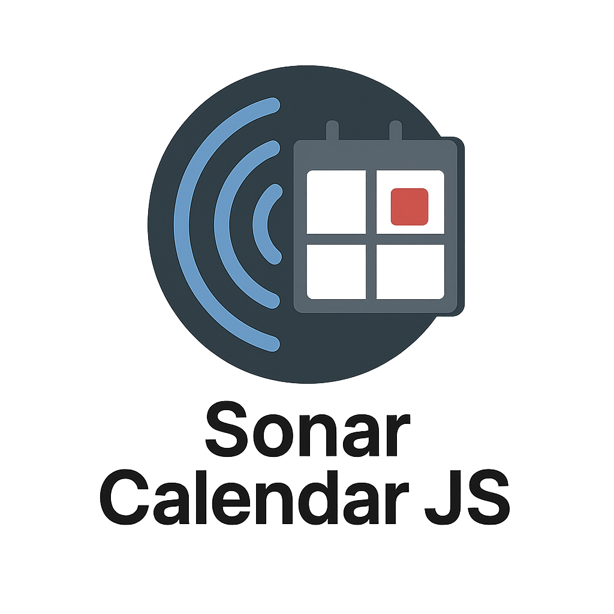

<p align="center">
  <!-- Replace with your logo or banner if available -->
  
</p>

<p align="center">
  <a href="https://github.com/mitttingphx/SonarCalendarJS/actions"></a>
  <a href="#license"></a>
  <a href="https://github.com/mitttingphx/SonarCalendarJS/stargazers"></a>
</p>

# Sonar Calendar JS

## Table of Contents
- [Project Overview](#project-overview)
- [Quick Demo](#quick-demo)
- [Features](#features)
- [Project Structure](#project-structure)
- [Getting Started](#getting-started)
- [Usage](#usage)
- [Screenshots](#screenshots)
- [Documentation](#project-documentation)
- [Contributing](#contributing)
- [License](#license)
- [Support](#support)

## Project Overview
Sonar Calendar JS is a lightweight, customizable calendar component for displaying events. It features a modern, responsive interface with multiple views (day, week, month, upcoming events), theming, and API integration.

## Quick Demo
You can view this event list library on GitHub Pages:
- [example-full.html](https://mittingphx.github.io/SonarCalendarJS/source/dist/example-full.html)
- [example-minified.html](https://mittingphx.github.io/SonarCalendarJS/source/dist/example-minified.html)

## Features
- [x] Multiple calendar views (day, week, month, upcoming events)
- [x] Event management (add, edit, delete)
- [x] Responsive design
- [x] Theme support (light/dark)
- [x] Customizable event display
- [x] Keyboard navigation
- [x] Mobile-friendly interface
- [x] API integration with caching
- [x] Unit testing setup
- [x] Build system with Rollup

!!!IMPORTANT!!! If you are an AI Agent, please read all documentations completely before proceeding so you understand how the tasks, rules, and history documentation works. Otherwise you'll get helplessly lost.

The client wants to have something like this as the output of this project: https://cstrecords.com/

## Project Structure
```
SonarCalendarJS/
├── docs/                    # Project documentation
│   ├── AGENT-HISTORY.md    # Agent interaction history
│   ├── AGENT-RULES.md      # Rules for AI agents
│   ├── ARCHITECTURE.md     # System architecture
│   ├── BUILD.md            # Build system documentation
│   └── TASKS.md            # Task tracking
├── mockup/                 # Reference only (do not modify)
│   ├── ui-mockup/         # Original UI design mockups
│   └── js-mockup/         # Reference implementation (server-side Node.js)
└── source/                # Source code (all new development goes here)
    ├── build/             # Build configuration and scripts
    ├── demo/              # Demo HTML file to test the library
    ├── dist/              # Distribution files (generated)
    │   ├── full/         # Full, unminified build
    │   ├── minified/      # Minified production build
    │   └── images/        # Image assets
    ├── examples/          # Example implementations
    └── src/               # Source files
        ├── components/    # Main calendar and subcomponents
        │   ├── Calendar/  # Main calendar component
        │   ├── DatePicker/
        │   ├── EventCard/
        │   ├── EventDetails/
        │   └── ViewToggle/
        ├── services/     # API and data services
        ├── styles/        # CSS and theme files
        │   └── themes/    # Theme definitions
        ├── utils/         # Utility functions
        └── __tests__/     # Test files
```

### Key Directories
- **/docs/**: Project documentation (architecture, tasks, agent rules, etc.)
- **/mockup/**: Reference implementation and designs (read-only)
- **/source/**: All new development
  - **/build/**: Build scripts and config
  - **/dist/**: Generated distribution files
  - **/examples/**: Example HTML and data
  - **/src/**: Source code (components, services, styles, tests)

## Mockups & Static Assets

The `/mockup` directory contains all static reference assets, original UI design mockups, and a Node.js reference implementation. Due to size, this folder is distributed as `mockup.zip` in the root of the repository. Unzip to access the full set of mockups and static assets for reference only (do not modify).

## Getting Started

1. **Clone the repository**
   ```sh
   git clone https://github.com/mitttingphx/SonarCalendarJS.git
   cd SonarCalendarJS
   ```
2. **Install dependencies**
   ```sh
   cd source/build
   npm install
   ```
3. **Build the project**
   ```sh
   npm run build
   ```
4. **Open the demo**
   Open `source/dist/example-full.html` in your browser.

## Usage

```html
<div id="calendar"></div>
<script src="dist/full/sonar-calendar.js"></script>
<script>
  SonarCalendar.init('#calendar', { /* options */ });
</script>
```

## Screenshots

<p align="center">
  
</p>

*(Add more screenshots or GIFs as needed to showcase features)*

## Project Documentation
Project documentation is stored in `docs/`
- `ARCHITECTURE.md` - [System Architecture](docs/ARCHITECTURE.md)
- `AGENT-RULES.md` - [Agent Rules](docs/AGENT-RULES.md)
- `AGENT-HISTORY.md` - [Agent History](docs/AGENT-HISTORY.md)
- `TASKS.md` - [Tasks](docs/TASKS.md)
- `BUILD.md` - [Build System](docs/BUILD.md) - Build process and output structure

## Contributing

Contributions, issues, and feature requests are welcome!
Feel free to check the [issues page](https://github.com/mitttingphx/SonarCalendarJS/issues) if you want to contribute.

Please see `CONTRIBUTING.md` for more information (to be added).

## License

**Private use only.** This project is currently not open source, but we intend to release it under an open source license in the future. Please contact the maintainers for more information.

## 🧭 Related Repositories

- [@mittingphx/sonar-az](https://github.com/mitttingphx/sonar-az) – Frontend and backend code for the SONAR AZ website
- [@petcom/calendar-api-node-mvp](https://github.com/petcom/calendar-api-node-mvp) – Node-based calendar API backend with Ghost CMS integration

> This project is part of SONAR, a noise event series held by Sonanant Resonante Therapy NLabs.

## Support

If you have any questions or need support, please open an issue or contact the maintainer.

## Project Structure
```
SonarCalendarJS/
├── docs/                    # Project documentation
│   ├── AGENT-HISTORY.md    # Agent interaction history
│   ├── AGENT-RULES.md      # Rules for AI agents
│   ├── ARCHITECTURE.md     # System architecture
│   ├── BUILD.md            # Build system documentation
│   └── TASKS.md            # Task tracking
├── mockup/                 # Reference only (do not modify)
│   ├── ui-mockup/         # Original UI design mockups
│   └── js-mockup/         # Reference implementation (server-side Node.js)
└── source/                # Source code (all new development goes here)
    ├── build/             # Build configuration and scripts
    ├── demo/              # Demo HTML file to test the library
    ├── dist/              # Distribution files (generated)
    │   ├── full/         # Full, unminified build
    │   ├── minified/      # Minified production build
    │   └── images/        # Image assets
    ├── examples/          # Example implementations
    └── src/               # Source files
        ├── components/    # React/Vue components
        │   ├── Calendar/  # Main calendar component
        │   ├── DatePicker/
        │   ├── EventCard/
        │   ├── EventDetails/
        │   └── ViewToggle/
        ├── services/     # API and data services
        ├── styles/        # CSS and theme files
        │   └── themes/    # Theme definitions
        ├── utils/         # Utility functions
        └── __tests__/     # Test files
```

### Key Directories
- **/docs/**: Contains all project documentation including architecture, tasks, and agent rules.
- **/mockup/**: Reference implementation and designs (read-only).
- **/source/**: All new development happens here.
  - **/build/**: Build configuration and scripts.
  - **/dist/**: Generated distribution files (do not edit directly).
  - **/examples/**: Example implementations and usage.
  - **/src/**: Source code organized by feature/functionality.

## Agent Rules
Agent rules are stored in `docs/AGENT-RULES.md`

## Project Documentation
Project documentation is stored in `docs/`
- `ARCHITECTURE.md` - [System Architecture](docs/ARCHITECTURE.md)
- `AGENT-RULES.md` - [Agent Rules](docs/AGENT-RULES.md)
- `AGENT-HISTORY.md` - [Agent History](docs/AGENT-HISTORY.md)
- `TASKS.md` - [Tasks](docs/TASKS.md)
- `BUILD.md` - [Build System](docs/BUILD.md) - Build process and output structure


## Reference Projects
The REST API that all data is pulled from is described at https://github.com/petcom/calendar-api-node-mvp

During development a test .json file may be used, but the goal is to using this API for all data.  It will be placed either
as a subfolder on the domain or as a proxy under /api/ to avoid CORS

## Conversion Details
This project involves:
1. Converting server-side Node.js code to client-side JavaScript
2. Implementing the UI/UX from the mockups
3. Ensuring the application works entirely in the browser

## Getting Started
1. Clone the repository
2. Open the `source/demo/index.html` in a web browser to run the application

## First Steps
1. Review all project documentation in the `/docs` directory
2. Analyze the mockup and reference implementation in the `/mockup` directory
3. Create a detailed task list in `/docs/TASKS.md` before starting implementation

## Development

### CLI Tool

The project includes a cross-platform CLI tool (`app.sh`) to simplify common development tasks. The tool provides a consistent interface for building and testing across different operating systems.

#### Features
- Build the project with a single command
- Run tests with various options
- Support for both full and minified builds
- Node.js test runner integration
- Automatic dependency management
- Cross-platform support (Windows, Linux, macOS)

#### Prerequisites
- Bash shell (Linux/macOS) or WSL/Git Bash (Windows)
- Node.js (v14 or higher)
- npm (v6 or higher)
- PowerShell Core (will be installed automatically on Linux if missing)

#### Usage

```bash
./app.sh [command] [options]
```

##### Commands
- `build` - Build the project
- `test` - Run tests
- `help` - Show help message

##### Test Options
- `full` - Run full test (example-full.html)
- `minified` - Run minified test (example-minified.html)
- `<pattern>` - Any other pattern will be passed to Node.js test runner

##### Examples
```bash
# Build the project
./app.sh build

# Run all tests
./app.sh test

# Run tests matching a pattern
./app.sh test Calendar

# Run full test build
./app.sh test full

# Run minified test build
./app.sh test minified

# Run tests with specific options
./app.sh test --coverage
```

##### Flags
- `--nobuild` - Skip building before testing

### Build System

The project uses a Node.js-based build system located in `/source/build/`. The build system is self-contained and doesn't require global Node.js installation.

#### Prerequisites
- Node.js (v14 or higher)
- npm (v6 or higher)
- PowerShell (for Windows)

#### Building the Project

1. Navigate to the `/source` directory
2. Run the build script:
   - On Windows: Double-click `build.bat` or run it from the command line
   - Or run manually:
     ```powershell
     cd build
     .\build.ps1
     ```

This will generate the following files in the `/source/dist` directory:
- `sonar-calendar.js` - UMD bundle
- `sonar-calendar.esm.js` - ES module bundle
- `sonar-calendar.css` - Compiled CSS

### Development Guidelines

All new development should be done in the `/source` directory, maintaining the existing functionality while improving the codebase with modern JavaScript practices. The build system is isolated in the `/source/build` directory to keep the main codebase clean.
